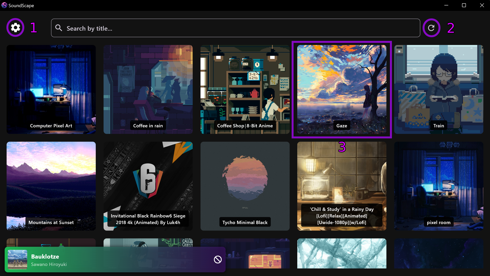
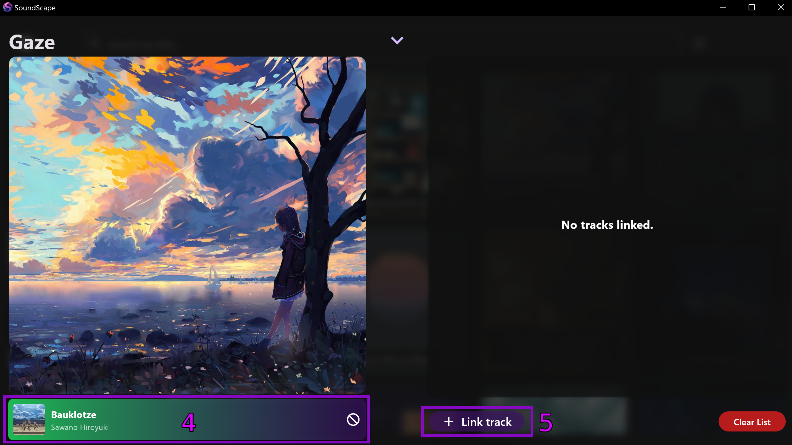

SoundScape

  

SoundScape is a Flutter-based desktop application designed to enhance your music experience by syncing wallpapers with Spotify tracks. The app dynamically updates your desktop wallpaper to match the currently playing track on Spotify.

## Usage

1. Open the settings and ensure the path to your Wallpaper Engine executable is set.

2. Use the reload button next to the search bar to refresh the wallpaper list.

3. Click on the wallpaper you want to link tracks to.

4. Ensure the Spotify card is visible in the bottom-left corner. If it’s not, play a track on Spotify and wait a few seconds.

5. Once the Spotify card is displayed, click the "Link Track" button next to it to associate the track with the selected wallpaper.

Enjoy!
There’s no limit to the number of tracks you can link to a single wallpaper or how many times a track can be linked.

  
 
  

## Configuration
Access the settings by clicking the gear icon in the top-left corner. Here’s what you can configure:

- Wallpaper Engine Path:
Manually set the path or use the "Auto Detect" button.

- Socket Port:
Specify the port for the media data fetcher to communicate with the Flutter app.

- Dark Mode:
Enabled by default because, well, dark mode reigns supreme. 🌑

- Load on Startup:
Automatically launch the application on device startup.

- Wallpaper Retention Time:
When a track has been linked multiple times to differnt wallpapers it will start a queue and change the wallpapers based on a timer
here you can set the time to wait between switching.

## License
This project is licensed under the GNU General Public License v3.0 (GPL-3.0).
You are free to use, modify, and distribute the software, provided that any derivative works are also licensed under the GPL-3.0.